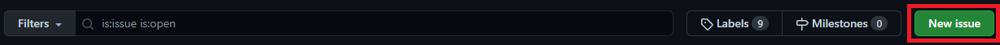
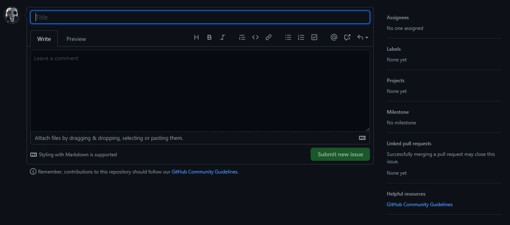
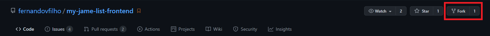
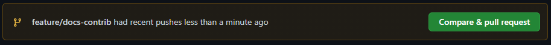
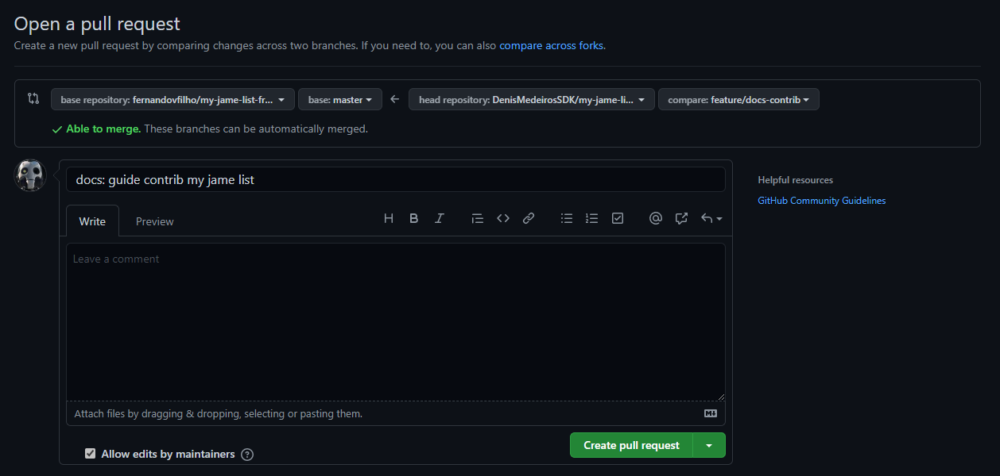

# My Jame List - Guia de contribuição

Para você que quer contribuir no **My Jame List** siga o passo a passo abaixo:

## Contribuição com issue:

Caso você não saiba programar ou não esta com tempo em ajudar no código, exites
a forma de contribuição com **Issues**, com ela você pode relatar um problema (BUG) que esta acontecendo em determinada situação do site, ou até mesmo solicitar uma nova funcionalidade que seja interessante para o site, basta ir para o repositório [clicando aqui](https://github.com/fernandovfilho/my-jame-list-frontend) e no menu clicar em [_Issues_](https://github.com/fernandovfilho/my-jame-list-frontend/issues), apos clique em **New issue**

_Obs: É necessário ter uma conta no github_



Faça sua contribuição, com titulo e descrição, e depois envie clicando em **Submit new issue**.


## Contribuição com código:

```bash
# Faça um fork do repositório no seu github
```



```bash
# Faça um clone do repositório
$ git clone https://github.com/fernandovfilho/my-jame-list-frontend.git

# Certifique-se que esteja na branch develop
$ git checkout develop

# Crie uma nova branch na ramificação da develop
$ git checkout -b <Nome da branch>
Ex: $ git checkout -b feature/docs-contrib

# Faça sua funcionalidade e envie para o seu github
$ git add .
$ git commit -m "Minha nova funcionalidade"
$ git push -u origin <Nome da branch>
Ex: $ git push -u origin feature/docs-contrib

```

Vá em seu github e crie uma nova pullRequest da branch que você criou para a develop do repositório principal



# Guia de execução

**Requisitos**:

NodeJS: v12.x.x

npm: v6.14.x

Porta **3000** do computador deve estar liberada
Apos feito o clone do projeto em seu computador instale as dependências

`npm install` ou `yarn`

Inicie o projeto com:

`npm run start` ou `yarn start`

Acesse em: [http://localhost:3000](http://localhost:3000)
